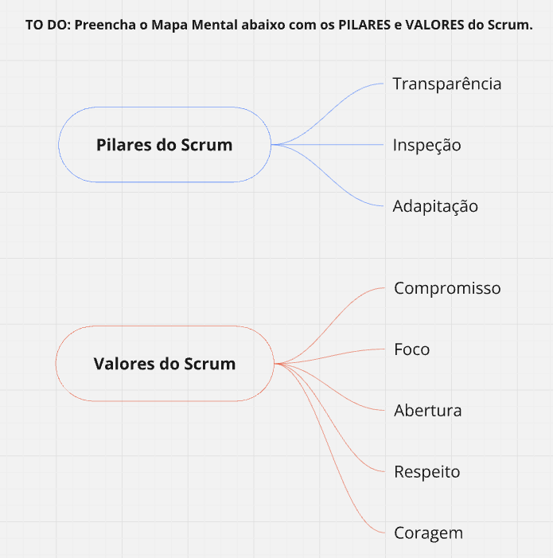
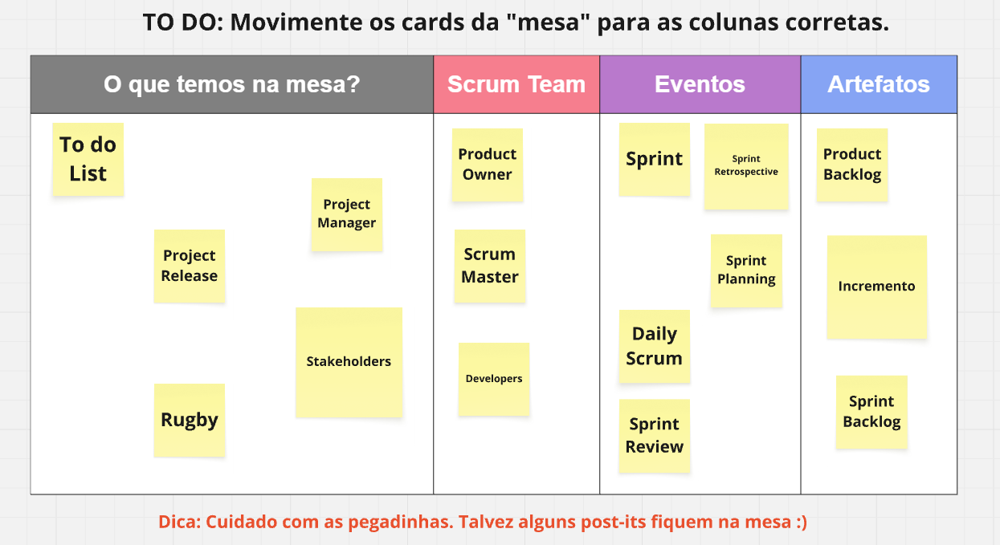
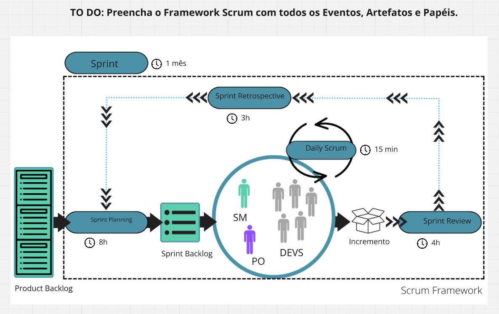

# Framework-Scrum
Desafio de Projeto da Formação Scrum Master (DIO) — atividades práticas de fixação dos conceitos fundamentais do Scrum, conforme o Scrum Guide 2020.

# Completando o Framework Scrum 🔄

> Desafio de Projeto da **Formação Scrum Master (DIO)** — atividades práticas de fixação dos conceitos fundamentais do Scrum, conforme o [Scrum Guide 2020](https://scrumguides.org/).

## Sobre o desafio

O desafio consistiu em três atividades visuais que testam a compreensão da estrutura do Scrum: mapear seus pilares e valores, classificar corretamente os elementos do framework e preencher o fluxo completo de uma Sprint com eventos, artefatos, papéis e timeboxes.

## Atividade 1 — Pilares e valores do Scrum

O Scrum se apoia no **empirismo**: decisões baseadas em observação e experiência, sustentadas por três pilares e viabilizadas por cinco valores.

- **Pilares:** Transparência · Inspeção · Adaptação
- **Valores:** Compromisso · Foco · Abertura · Respeito · Coragem

Os pilares dependem dos valores para funcionar: sem coragem e abertura não há transparência real; sem transparência, a inspeção enxerga dados distorcidos; e inspeção sem adaptação é desperdício.

## Atividade 2 — Classificando os elementos

Distribuição dos cards entre **Scrum Team**, **Eventos** e **Artefatos** — com atenção às pegadinhas: itens que não pertencem ao Scrum permanecem na mesa.

| Coluna | Elementos |
|---|---|
| Scrum Team | Product Owner, Scrum Master, Developers |
| Eventos | Sprint, Sprint Planning, Daily Scrum, Sprint Review, Sprint Retrospective |
| Artefatos | Product Backlog, Sprint Backlog, Incremento |
| Ficam na mesa 🪤 | To do List, Project Release, Project Manager, Stakeholders, Rugby |

**Por que as pegadinhas ficam de fora?** *Project Manager* é justamente o papel que o Scrum dissolve entre PO, Scrum Master e time; *Rugby* é apenas a origem histórica do nome do framework; *Stakeholders* participam da Sprint Review, mas não integram o Scrum Team; *To do List* e *Project Release* não são artefatos formais do Scrum Guide.

## Atividade 3 — O fluxo completo do framework

Preenchimento do diagrama do Scrum com todos os eventos (e seus timeboxes), artefatos e papéis.

O fluxo: o **Product Backlog** (artefato, mantido pelo PO) alimenta a **Sprint Planning** (máx. 8h), que produz o **Sprint Backlog** (artefato). O **Time Scrum** — Product Owner, Scrum Master e Developers — trabalha os itens com sincronização diária na **Daily Scrum** (15 min), gerando o **Incremento** (artefato), inspecionado na **Sprint Review** (máx. 4h). A **Sprint Retrospective** (máx. 3h) fecha o ciclo com melhorias de processo. Tudo isso ocorre dentro da **Sprint** (timebox de 1 mês ou menos) — o evento contêiner representado pela moldura tracejada: quando uma Sprint termina, a próxima começa imediatamente.

> 💡 Os timeboxes de Planning, Review e Retrospective são máximos para Sprints de 1 mês; Sprints mais curtas reduzem esses limites proporcionalmente.

## Principais aprendizados

1. **Sprint Backlog é artefato, não evento** — é o produto da Sprint Planning (meta + itens selecionados + plano), não uma cerimônia.
2. **A Sprint é um evento sem ser uma reunião** — ela é o contêiner de duração fixa dentro do qual todos os demais eventos acontecem; o "coração do Scrum".
3. **Não existe Project Manager no Scrum** — as responsabilidades de gestão se distribuem entre os três papéis, cada um com accountability própria.

## Referências

- [Scrum Guide 2020 (Schwaber & Sutherland)](https://scrumguides.org/)
- [Manifesto para Desenvolvimento Ágil de Software](https://agilemanifesto.org/iso/ptbr/manifesto.html)
- [Scrum.org](https://www.scrum.org/)
- https://miro.com/app/board/uXjVH_EsbTs=/?share_link_id=691735009544

---

*Repositório criado como entrega do Desafio de Projeto da [Formação Scrum Master — DIO](https://www.dio.me/).*
